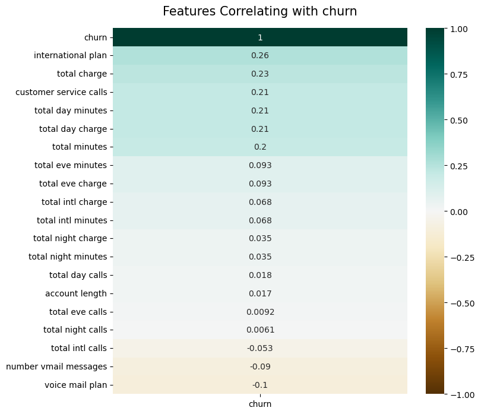
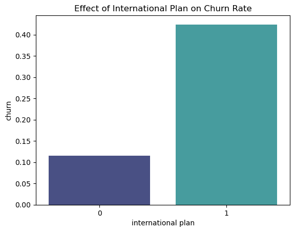
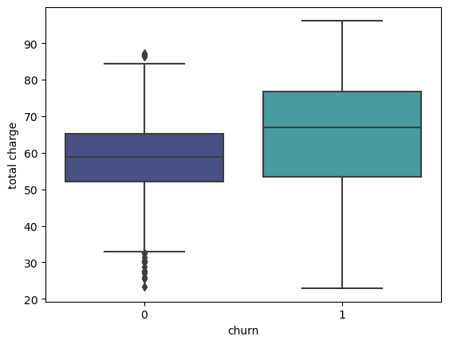
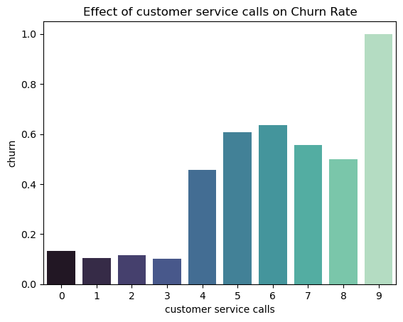
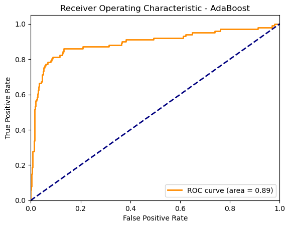
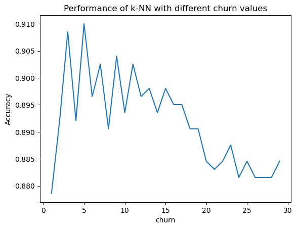

BUSINESS UNDERSTANDING

In this project the aim was to  predict whether a customer will ("soon") stop doing business with SyriaTel, a telecommunications company. This is a binary classification problem. the first step was to analyze the key factors affecting customers doing business with SyriaTel.I employed  six machine learning models namely:
1. Logistic Regression
2. Decison Tree
3. RandomForestClassifer
4. Adaboost
5. K-nearest neighbor
6. Gradient boosting

BUSINESS PROBLEM

Most naturally, your audience here would be the telecom business itself, interested in reducing how much money is lost because of customers who don't stick around very long. The question you can ask is: are there any predictable patterns here?

OBJECTIVES:

1. predict the patterns that contribute to customer churn, and to which level.

2. Predict the patterns that are highly correlated with churn.

CONTEXT:

0- it standards for customers who havent stopped doing business with SyriaTel.(non-churn)

1- it standards for clients who stopped doing business with SyriaTel(churn).

Evaluation:
for the evaluation bit,  i used precision ,recall, f1-score and support to characterize churn and non churn from the different models.

STARTING POINT:

i started by loading the dataset from there ,checking the datatset, describing the dataset to get a statistical review. from there eda , converting the target variable which is churn to a integer. from there encoding categorical variables .
i also added two more columns total charge and total minutes .

From there i checked for correlation between the target variables and other columns 
the correlation was as follows:

the correlation was high between the international plan, total charge and customer service calls.
from there i made visualizations for each of the columns that were highly correlated with the target variable churn.

MODELLING:
i started by predicting the x and y variables
i did training and test split of datasets
finally i scaled numeric features.

LOGISTIC REGRESSION:

from the above graph the accuracy rate is at 85.6%, the precision for non churn is 87% and for churn is 58%. recall from non churn is 98% and for churn is 18% f1 score for non churn 92% and for churn 27%. The model has high overall accuracy (85.6%), but this is largely driven by the model's performance on the majority class (class 0).
Accuracy: 0.856071964017991

DECISION TREE:

 The model has a high accuracy of 95.2% indicating that it correctly predicts the churn status for a large proportion of the samples.it has a relatively high recall (0.89), indicating that it correctly identifies a significant proportion of actual churn cases. it also performs well in identifying non churn customers from the precision and recall of class(0)
Accuracy: 0.952023988005997

RANDOM FOREST CLASSIFER:

Precision is 1.00, for class(1) meaning that 100% of the customers predicted as churners are actually churners. with an accuracy of 98% means that the predictions made by the model are correct. This method is strongly effective in predicting customer churn with a good performances in identifying non churn and churn
Accuracy: 0.9805097451274363

finally i finalized with adaboost and an roc curve
ADABOOST CLASSIFER AND ROC CURVE:

AdaBoost Accuracy: 0.9145427286356822

With an AUC of 0.89, the AdaBoost model performs well in distinguishing between churn and non-churn customers. The closer the AUC is to 1, the better the model is at making these distinctions.
The ROC curve shows that the AdaBoost model has a high true positive rate (sensitivity) for most thresholds, indicating it correctly identifies a large proportion of churn instances.

K Nearest Neighbor:

i was able to do my k neraest model , it analysis where as follows The model has a high precision for both classes, indicating that most of the predicted. The model performs well overall with a high accuracy of 0.91

Gradient boosting:

The model performed well with an accuracy of 97.9%, this shows it made correct predictions most of the time.The high f1_score,recall and precision for both classes indicates the model is effective in distinguishing both classes.

CONCLUSIONS:
1. the customer churn rate was mostly affected by the international plan, total charges, customer service calls and voice mail messages.
2. Randomforest classifer was the most effective and robust model  for identifying both classes from churn to non churn.
3. from the ROC curve , we get to understand AdaBoost model has a high true positive rate  for most thresholds, indicating it correctly identifies a large proportion of churn instances and low positive rate it does not frequently misclassify non-churn instances as churn.

RECCOMENDATIONS:
1. The Syria Tel communication company, needs to make a better international plan, for clients enrolled for the international plan.eg better connectivity, low charge rates
2. They also need to be proactive in offering great customer support and also collecting feedback reports from client so as to reduce their churn rate thus losing money.
3. They should look for methods to engage clients more and also give offers, so as those affected by a high total charge could feel considered.eg  loyalty rewards, discounts
4. Implement a system to generate predictive alerts for customers who are likely to churn. This allows the customer support team to intervene early and offer solutions to retain them.

